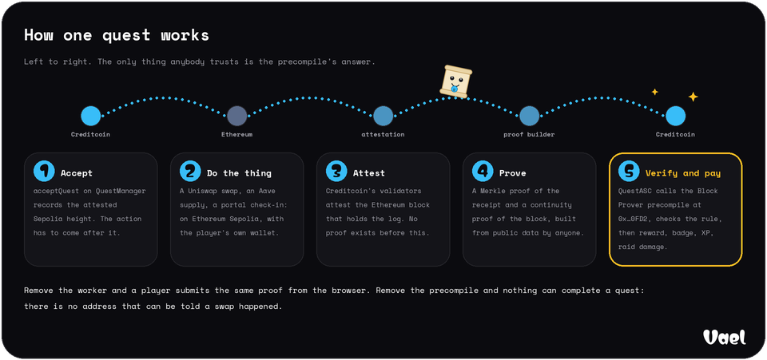
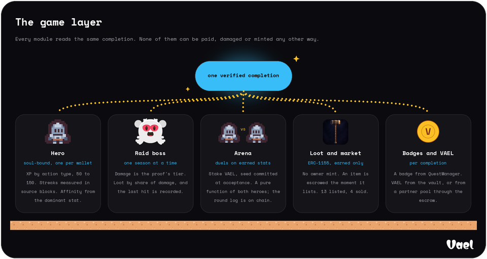
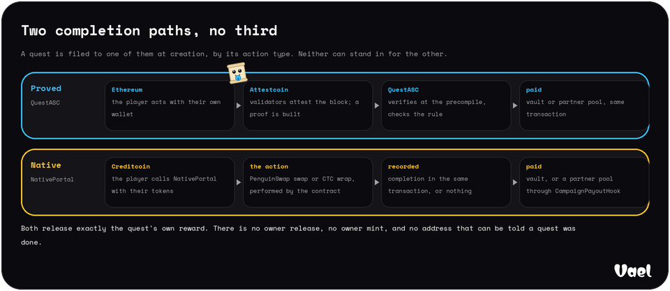

**Vael is a quest game on Creditcoin where no key can hand out a reward.**
Players do real DeFi on Ethereum; the Attestcoin Protocol proves the transaction to Creditcoin; a contract verifies the proof itself and only then pays, mints the badge, grants the XP and deals the raid damage.


Hackathon: BUIDL CTC 2026 Fall, Gaming track and Defi Track.


---

## Contents

1. [The removal test](#the-removal-test)
2. [How one quest works](#how-one-quest-works)
3. [The game layer](#the-game-layer)
4. [The two completion paths](#the-two-completion-paths)
5. [What is deployed](#what-is-deployed)
6. [Run it locally](#run-it-locally)
7. [Evidence](#evidence)
8. [Limitations](#limitations)
9. [Links](#links)

## The removal test

Every quest platform has a key somewhere that a reward contract obeys.
Whoever holds it can pay for an action that never happened, through the intended interface.
Vael's claim is that it has no such key, and the claim is checkable in commands that send nothing and need no key of their own.

The address below is the deployer, which owns every contract in the system.
Asked to complete quest 1, `QuestManager` refuses it and names the only address it would accept:

```bash
cast call 0x56385ac5cc5F1817ac96d8D1632E53f3A9a412B7 \
  'recordCompletion(uint256,address,bytes32,bytes32)' \
  1 0x017DFB929979AC1b7e1a080c88Db56Bee45846d2 \
  0x0000000000000000000000000000000000000000000000000000000000000000 \
  0x0000000000000000000000000000000000000000000000000000000000000000 \
  --from 0x017DFB929979AC1b7e1a080c88Db56Bee45846d2 \
  --rpc-url https://rpc.cc3-testnet.creditcoin.network
```

```
Error: execution reverted: QuestManager__WrongCompleter(0x017DFB929979AC1b7e1a080c88Db56Bee45846d2, 0x05958dD789EaC1de84e864d6b3956C90d3e90d0f)
```

The address it names is `QuestASC`, which completes a quest only inside a call that has just verified an Attestcoin proof at the block prover precompile.
The same wall stands in front of everything a completion produces.
Each of these was run against the live deployment the day this README was written:

| Ask the owner's key to | Contract | Answer |
|---|---|---|
| grant hero XP | `VaelHero.onQuestCompleted` | `VaelHero__OnlyQuestASC(0x017DFB92…)` |
| release VAEL from the vault | `RewardVault.releaseReward` | `RewardVault__OnlyQuestManager` |
| release VAEL from a partner pool | `CampaignEscrow.releaseReward` | `ReleaserSet__NotAReleaser(0x017DFB92…)` |

Remove Vael's worker and a player can build the same proof in the browser and submit it from their own wallet.
Remove the precompile and nothing can complete a quest at all.
There is no address that can be told a swap happened.

## How one quest works



1. **Accept.** `QuestManager.acceptQuest` records the latest Ethereum height Creditcoin has attested. The action has to land after it, so a player cannot claim a transaction they made before taking the quest.
2. **Do the thing.** A Uniswap v3 swap, an Aave v3 supply or borrow, an ERC-20 transfer, or a check-in through Vael's own portal contract, on Ethereum Sepolia, with the player's own wallet.
3. **Attest.** Creditcoin's validators attest the Ethereum block that holds the log. Until they do, no proof of it exists.
4. **Prove.** A Merkle proof of the receipt and a continuity proof of the block, built from public data by Vael's worker or by the player's browser; nothing in either is signed by Vael.
5. **Verify and pay.** `QuestASC` hands the proof to the Block Prover precompile at `0x…0FD2`, then checks the receipt status, the emitting contract against an allowlist, the player against the log's own indexed address, the amount against the rule's minimum, and the block against the window recorded at acceptance. Only then does it record the completion, and the reward, the badge, the XP and the raid damage all follow from that one call.

Live examples of every path, from the Ethereum action to the Creditcoin payout, with every hash: [`docs/EVIDENCE.md`](./docs/EVIDENCE.md).
How each Attestcoin surface is used, with measurements: [`docs/ATTESTCOIN_INTEGRATION.md`](./docs/ATTESTCOIN_INTEGRATION.md).

## The game layer



Every module reads the same completion, and none of them can be paid, damaged or minted any other way.
A hero is soul-bound and earns XP by action type; its streak is measured in Ethereum source blocks, so it cannot be faked with Creditcoin time.
The raid boss takes damage equal to the proof's tier, loot drops by share of damage, and the last hit is on chain.
Duels are a pure function of two heroes' earned stats and a seed committed at acceptance; the round log is emitted by the contract and the replay draws it.
Loot has no owner mint: every item exists because somebody defeated a boss or won a duel, and it is escrowed the moment it is listed.

Game truth lives on Creditcoin.
The Phaser client renders and replays; it never decides an outcome.

## The two completion paths



Attestcoin attests other chains to Creditcoin; it does not attest Creditcoin to itself, so a PenguinSwap swap on Creditcoin has no proof to carry.
Rather than add a trusted reporter, Vael has a second contract, `NativePortal`, that **performs** the action: it pulls the player's tokens, calls PenguinSwap's router or wraps CTC, reads what came back, checks it against the quest's rule, and records the completion in the same transaction.
If the swap does not happen, nothing completes.

A quest is filed to one path at creation by its action type, and `QuestManager.recordCompletion` accepts nobody but the path the quest was filed to.
Both release exactly the quest's own reward: from `RewardVault` for an open quest, from the partner's `CampaignEscrow` pool for a campaign quest, whose releasers are a set that changes only after a day's public notice.
The one honest difference is written down in [`docs/ARCHITECTURE.md`](./docs/ARCHITECTURE.md), section 4.

## What is deployed

Twenty-two contracts on Creditcoin testnet and one on Ethereum Sepolia, all source-verified, with deploy transactions, blocks, wiring, and every superseded deployment and the reason it was replaced: [`docs/ADDRESSES.md`](./docs/ADDRESSES.md).

| Contract | Creditcoin testnet (102031) |
|---|---|
| `QuestASC` | [`0x05958dD789EaC1de84e864d6b3956C90d3e90d0f`](https://creditcoin-testnet.blockscout.com/address/0x05958dD789EaC1de84e864d6b3956C90d3e90d0f) |
| `QuestManager` | [`0x56385ac5cc5F1817ac96d8D1632E53f3A9a412B7`](https://creditcoin-testnet.blockscout.com/address/0x56385ac5cc5F1817ac96d8D1632E53f3A9a412B7) |
| `NativePortal` | [`0xa512544f721230Fa04560078D0dC214423FE2970`](https://creditcoin-testnet.blockscout.com/address/0xa512544f721230Fa04560078D0dC214423FE2970) |
| `CampaignEscrow` | [`0x48f5612Bd48ad29f6Aefd8700EbD3946F0511b28`](https://creditcoin-testnet.blockscout.com/address/0x48f5612Bd48ad29f6Aefd8700EbD3946F0511b28) |
| `CampaignPayoutHook` | [`0xeeB8A2EEf0D8b4B28D50ce130E7a70b871F621b1`](https://creditcoin-testnet.blockscout.com/address/0xeeB8A2EEf0D8b4B28D50ce130E7a70b871F621b1) |
| `RewardVault` | [`0x89aE45f3B75E20af549715294754292eFf25b89C`](https://creditcoin-testnet.blockscout.com/address/0x89aE45f3B75E20af549715294754292eFf25b89C) |
| `VaelToken` | [`0x7131E59d5068BE6Ecdd1bfED2e81C85Ba2aa90Cf`](https://creditcoin-testnet.blockscout.com/address/0x7131E59d5068BE6Ecdd1bfED2e81C85Ba2aa90Cf) |
| `BadgeNFT` | [`0x6b57F8a913FBC175ff46B53542F23D362e46d8f2`](https://creditcoin-testnet.blockscout.com/address/0x6b57F8a913FBC175ff46B53542F23D362e46d8f2) |
| `VaelHero` | [`0x74befcC907073f5F0125813FEF3A2A22406d3024`](https://creditcoin-testnet.blockscout.com/address/0x74befcC907073f5F0125813FEF3A2A22406d3024) |
| `RaidBoss` | [`0xF3492B8491f3f9a3272C03b8779374c9eF3D9A7B`](https://creditcoin-testnet.blockscout.com/address/0xF3492B8491f3f9a3272C03b8779374c9eF3D9A7B) |
| `Arena` | [`0xa98672b481c35f76d09612849E75A2c7A1a976d9`](https://creditcoin-testnet.blockscout.com/address/0xa98672b481c35f76d09612849E75A2c7A1a976d9) |
| `Loot` | [`0xFf0271fb151F25cf909d1d8b16017Af54FBb9938`](https://creditcoin-testnet.blockscout.com/address/0xFf0271fb151F25cf909d1d8b16017Af54FBb9938) |
| `Marketplace` | [`0x868Bb518122B670Cd02b93dEeDc6B53DcFA36374`](https://creditcoin-testnet.blockscout.com/address/0x868Bb518122B670Cd02b93dEeDc6B53DcFA36374) |
| `QuestPortal` (Sepolia) | [`0x62d937DC3410C9C79078A521dA254E6fD53936F1`](https://sepolia.etherscan.io/address/0x62d937DC3410C9C79078A521dA254E6fD53936F1) |

What the deployment holds, read from the chain and the index at Creditcoin block 5479941:

| | |
|---|---|
| Quests on the current `QuestManager` | 44, of which 19 completed |
| Completions proved through Attestcoin | 13 |
| Completions performed by `NativePortal` | 6 |
| Heroes minted | 6 |
| Badges minted | 45 |
| Raid seasons fought | 3, all defeated, 2,900 damage in 16 hits |
| Duels fought | 22, of which 21 resolved and 1 voided |
| Loot dropped | 27 items |
| Market | 13 listed, 4 sold, 86 VAEL of volume |
| Partner pools | 4 funded, holding 1,629.2 VAEL, 770 VAEL released to players |
| VAEL released in all | 2,675 |

## Run it locally

```bash
pnpm install
git submodule update --init --recursive
cd contracts && forge build && forge test && cd ..
```

Copy `apps/api/.env.example` and `apps/web/.env.example` to their real counterparts and fill them in; every variable is documented beside its name in those files, and `python3 contracts/script/sync-env.py --write` fills the contract addresses from `docs/ADDRESSES.md`.
Real env files are ignored and must never be committed.

Then build everything for production and start the four processes against the live Creditcoin testnet deployment.

```bash
pnpm build
pnpm --filter @vael/api start            # API on :4000
pnpm --filter @vael/api start:worker     # the proof worker
pnpm --filter @vael/api start:indexer    # the Creditcoin indexer
pnpm --filter @vael/web start -p 3101    # the web app
```

| | |
|---|---|
| App | http://localhost:3101 |
| API health | http://localhost:4000/health |

| Process | What it does |
|---|---|
| API | quest catalogue, campaigns, the Studio's pinning and publishing, the AI quest scheduler |
| Proof worker | watches Ethereum for accepted quests' actions, builds and submits proofs |
| Creditcoin indexer | reads every contract's events into the store the site reads from |
| Web | the Next.js app: board, campaigns, Academy, hero, raid, arena, market, Studio |

The worker and the indexer need no private key that can complete anything: the worker pays gas to submit proofs, and a proof is either valid or it is not.

For development, `pnpm --filter @vael/web dev` on :3001 and `pnpm --filter @vael/api dev` on :4000.

## Evidence

| What | Where |
|---|---|
| Every feature exercised on the live network, with hashes, blocks, and gas | [`docs/EVIDENCE.md`](./docs/EVIDENCE.md) |
| How Vael uses Attestcoin, surface by surface, with measurements | [`docs/ATTESTCOIN_INTEGRATION.md`](./docs/ATTESTCOIN_INTEGRATION.md) |
| Deployed addresses, wiring, and the full supersession history | [`docs/ADDRESSES.md`](./docs/ADDRESSES.md) |
| The architecture as deployed: contracts, the two completion paths, adapters and hooks, worker, indexer, web app | [`docs/ARCHITECTURE.md`](./docs/ARCHITECTURE.md) |
| The whitepaper: the argument, the threat model, the measurements | [`docs/WHITEPAPER.md`](./docs/WHITEPAPER.md) |
| Ethereum mainnet feasibility spike, keyless, with its conditions | [`docs/MAINNET_SPIKE.md`](./docs/MAINNET_SPIKE.md) |
| Screenshots of every page at 1280 and 390 px from the production build | [`docs/evidence/final/`](./docs/evidence/final) |

Tests: 265 in Foundry, 39 in Jest, 45 in Vitest, and `contracts/script/VerifyBaseline.s.sol` runs 141 keyless checks against the live deployment.

## Limitations

- **Testnet only.** Creditcoin testnet and Ethereum Sepolia. The mainnet spike shows the Ethereum side is feasible without a key; nothing is deployed there.
- **Not hosted yet.** Every number above came from running the app locally against the public deployment; the addresses and hashes can be checked without running anything.
- **A native campaign quest's payout is a hook, not a revert.** `NativePortal` cannot be replaced without a full redeploy, so its payout runs as a hook it calls: an underfunded pool is skipped and said, where `QuestASC` would revert the whole completion. Two early native completions (quests 16 and 29) were made before that hook existed and stay unpaid, because paying them by hand would be the privileged path the escrow refuses to have.
- **A quest's document is fixed at creation.** `QuestManager` has no metadata setter, so a pinned picture or title cannot be changed afterwards; a pool's own document can, through the Studio.
- **Public gateways rate-limit.** Pinned pictures load through public IPFS gateways and sometimes do not; every card falls back to the action's own artwork.
- **The AI scheduler writes to chain.** Daily and weekly quests are generated from a player's proved history by a registered ERC-8004 agent; the model chooses the quest, and the chain still decides the completion.

## Links

| | |
|---|---|
| Live website | pending |
| Demo video | pending |
| Twitter or X | pending |
| GitHub | pending |
| DoraHacks submission | pending |
| Whitepaper | pending a hosted URL; in the repository at [`docs/WHITEPAPER.md`](./docs/WHITEPAPER.md), rendered at `/whitepaper` |
| Documentation | pending a hosted URL; in the repository at [`docs/`](./docs), the README rendered at `/readme` |

## License

MIT. See [LICENSE](./LICENSE).
