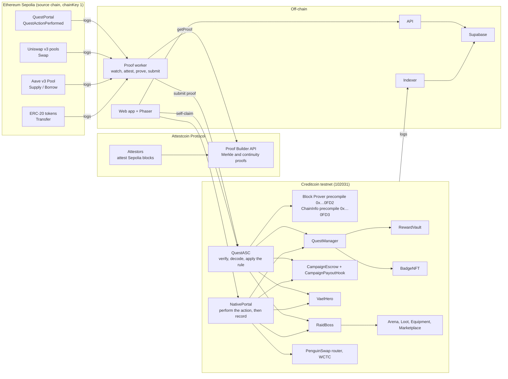

# Architecture

Vael is a quest game whose rewards are released by contracts on Creditcoin, and only by them.
A player performs a real DeFi action, the Attestcoin Protocol attests the block it landed in, and `QuestASC` verifies a proof of that transaction on Creditcoin before anything is paid.
No key held by the operator, the backend, or the quest-creating agent can complete a quest.

This document describes the system as deployed.
Addresses are in [`ADDRESSES.md`](./ADDRESSES.md), the Attestcoin integration in detail is in [`ATTESTCOIN_INTEGRATION.md`](./ATTESTCOIN_INTEGRATION.md), and the live transactions that exercise every feature are in [`EVIDENCE.md`](./EVIDENCE.md).

## 1. The shape of the system

Three chains of custody meet at `QuestManager.recordCompletion`.
It accepts a completion from exactly one contract per quest, the completer the quest was filed to at creation, and rejects every other caller with `QuestManager__WrongCompleter`.
Everything that pays, mints, or credits sits behind that call.

## 2. Chains and the trust boundary

| Chain | Id | What lives there |
|---|---|---|
| Creditcoin testnet | 102031 | Every contract that holds state or value: quests, rewards, badges, heroes, raids, duels, loot, listings, campaign pools |
| Ethereum Sepolia | 11155111 | The source actions players prove, and `QuestPortal`, Vael's own one-event contract |

Attestcoin attests Ethereum blocks to Creditcoin.
Its Block Prover precompile at `0x…0FD2` verifies a Merkle proof of a transaction against an attested block, and the ChainInfo precompile at `0x…0FD3` reports how far attestation has reached.
`QuestManager` reads the second at acceptance, so the action a player proves must land strictly after the block that was already attested when they accepted the quest.
A transaction from before acceptance cannot be claimed.

Nothing off chain is trusted for an outcome.
The worker, the indexer, the API, and the web app can all be switched off and the contracts keep the same rules.

## 3. Contracts

All contracts are Solidity 0.8.28 on the `shanghai` target, verified on Blockscout.

| Contract | Role | Who may call the sensitive function |
|---|---|---|
| `QuestManager` | Quest lifecycle: `createQuest`, `acceptQuest`, `recordCompletion` | Creation by a registered ERC-8004 agent; completion by the quest's filed completer only |
| `QuestASC` | The proof gate. Verifies an Attestcoin proof, decodes the log through an adapter, applies the quest's rule, records the completion, pays a campaign reward, runs the hooks | Anyone may submit a proof; the chain decides |
| `NativePortal` | The second completer. Performs a Creditcoin action with the player's own tokens and records the completion in the same transaction | The player, for their own accepted quest |
| `RewardVault` | Mints and releases VAEL per completion | `QuestManager` only |
| `CampaignEscrow` | Partner-funded reward pools, keyed by campaign id | Deposits by anyone; releases by the releaser set; refunds through `QuestASC.refundCampaign` |
| `CampaignPayoutHook` | Lets the native path pay a campaign quest: releases exactly the quest's reward, once, for a completion `QuestManager` confirms | Runs as a `NativePortal` hook |
| `BadgeNFT` | Soul-bound ERC-721 quest badges, ten levels | `QuestManager` only |
| `VaelHero` | Hero XP, level, streak, and stats | The completer set |
| `RaidBoss` | Seasonal boss with per-player damage and a leaderboard | The completer set |
| `Arena` | Duels between heroes; the seed block is committed at acceptance | Any hero owner |
| `Loot`, `Equipment`, `Marketplace` | Drops from raids and duels, equip slots, VAEL-priced listings | Raid loot is claimed by a contributor once the season is defeated; arena loot is minted for `Arena`; the rest by the item owner |
| `VaelToken` | VAEL, the ERC-20 reward token | Minted by `RewardVault` |
| `IdentityRegistry`, `ReputationRegistry`, `ValidationRegistry`, `AgentRegistryAdapter` | ERC-8004 registries; the quest-creating agent is registered here | Owner |
| `QuestPortal` (Sepolia) | Moves the asset a portal quest asks for and emits `QuestActionPerformed` with the player indexed | The player |

### Bindings that cannot be quietly changed

- `QuestManager.setQuestASC` and `QuestManager.setNativePortal` are one-shot.
  Replacing a completer means replacing `QuestManager` and everything that holds it immutably.
- `VaelHero`, `RaidBoss`, and `CampaignEscrow` trust a set rather than an address: `CompleterSet` for the two modules and `ReleaserSet` for the escrow.
  Each is bootstrapped once at deployment and changed only by a proposal that cannot take effect for 24 hours, visible on chain the whole time.
- `RewardVault` and `BadgeNFT` accept `QuestManager` only.
- Hooks are gas-capped (`HOOK_GAS_LIMIT = 400,000`) and a failing hook does not take the payout with it.

## 4. The two completion paths

A quest names an action type at creation, and the action type decides which completer it is filed to.
The two paths make different claims and the interface labels them differently.

### Proved: `QuestASC`

For actions on Ethereum: a portal check-in, a Uniswap v3 swap, an ERC-20 transfer, an Aave v3 supply, an Aave v3 borrow.

1. The player accepts the quest on Creditcoin.
   `QuestManager` records the attested Sepolia frontier from ChainInfo as the quest's floor.
2. The player performs the action on Sepolia.
3. Attestation covers the block, seven to nine minutes later.
4. The proof worker, or the player from their own wallet, fetches a Merkle proof and a continuity proof for that transaction from the Proof Builder and calls `QuestASC.submit`.
5. `QuestASC` verifies the proof through the precompile, requires `receiptStatus == 1`, selects a handler from the emitting address and `topics[0]` of the verified log, checks the emitter allowlist, the player binding from an indexed topic, the amount minimum, and the block window, then calls `recordCompletion`.

The replay key is `keccak256(chainKey, blockHeight, txIndex, logOrdinal)`, so one Ethereum transaction with two quest-relevant logs can complete two quests, and no log can complete twice.
The transaction index is recovered from the proof itself, never taken from the caller.
Batches carry one continuity proof per member because, on the live network, one continuity proof proves exactly one height.

### Native: `NativePortal`

For actions on Creditcoin: wrapping CTC into WCTC, and a PenguinSwap swap.
Attestcoin attests other chains to Creditcoin, not Creditcoin to itself, so these have no proof to carry.
Rather than add a contract that is told a swap happened, `NativePortal` does the swap.
It pulls the player's tokens, calls the router, reads what came back, checks it against the quest's rule, and records the completion in the same transaction.
If the swap reverts or returns too little, nothing completes.

The path is keyless and synchronous, and it is not cross-chain.
A quest filed to `NativePortal` cannot be completed by `QuestASC`, and the reverse.

### No key can pay a player

Delete the worker's key, the agent's key, and the deployer's key from every machine.
Every quest still completes exactly as before, from the player's own wallet.
Give the deployer's key to an attacker.
They can create quests and propose a completer change that lands a day later in public; they cannot release VAEL, mint a badge, or mark a quest complete.
The named reverts a judge can reproduce are `QuestManager__WrongCompleter`, `VaelHero__OnlyQuestASC`, `RewardVault__OnlyQuestManager`, and `ReleaserSet__NotAReleaser`.

## 5. Adapters and hooks

**Adapters** decode.
Each is a stateless contract registered in `QuestASC` per `topics[0]`, handed a log the precompile has already verified, and asked what it means: which action type, which player, which token, what amount.
An adapter holds no privilege and cannot widen what is accepted; the rule, the allowlist, the replay ledger, and the payout stay in `QuestASC`.
There are four: `PortalAdapter`, `Erc20TransferAdapter`, `UniswapV3SwapAdapter`, and `AaveV3Adapter` (supply and borrow).
Adding a protocol is one registration transaction.
A handler may decline a log rather than revert, which is what lets a Uniswap swap's own ERC-20 `Transfer` logs pass beside its `Swap`.

**Hooks** react.
After a completion is recorded, the completer notifies its hooks in order: `VaelHero` first, because `RaidBoss` reads the level `VaelHero` has just written.
`NativePortal` carries a third hook, `CampaignPayoutHook`, which is how a native campaign quest reaches the escrow.
A campaign whose pool cannot cover the reward emits `CampaignRewardSkipped` instead of reverting, so a partner's empty pool never blocks a player's badge or XP.

## 6. Campaigns

A partner funds a pool in `CampaignEscrow` under a campaign id; 0.5% of each deposit is the platform fee.
Quests created for that campaign pay from the pool rather than from `RewardVault`.
The pool key is `keccak256` of the campaign id and does not depend on which escrow holds it.
A partner's unspent budget is returned through `QuestASC.refundCampaign`, an owner decision about a cancelled campaign rather than a self-service withdrawal a player could race.

A campaign's name, description, and picture are a document pinned to IPFS and registered through the API.
The web app falls back to the first quest's title when a pool has no document.

## 7. Game modules

- **VaelHero**: one hero per player.
  A completion grants XP by action and tier (five and twenty-five times the rule's minimum promote a completion to tiers 2 and 3), a streak multiplier applies inside a block window, and level follows XP.
- **RaidBoss**: a seasonal boss.
  Each completion lands damage by action and tier; a season is defeated when its hit points reach zero, and the next one is started by the owner.
- **Arena**: duels.
  A challenge commits the seed block at acceptance and resolution is bounded, so neither side can wait for a block they like.
  Damage is `2 + 2L + 2S + A` against `100 + 10L + 3I` hit points, so a level-1 duel ends around round ten.
- **Loot** and **Equipment**: a contributor to a defeated season claims one item, its rarity set by their share of the damage; duel wins mint an item; items have a slot and stat bonuses, and equipping one changes a hero's effective stats.
- **Marketplace**: VAEL-priced listings of items.

Phaser renders and replays these; it never decides an outcome.
Every number on screen is read from the chain or from the index of the chain's own events.

## 8. The ERC-8004 agent

Quests are created by an agent registered in the ERC-8004 identity registry.
`QuestManager.createQuest` checks the registration through `AgentRegistryAdapter`, and `ReputationRegistry` and `ValidationRegistry` record what the agent has done.
The AI quest generator in the API composes quest text from verified chain data only and creates the quest as that agent.
Creation is the agent's only power; it has none over completion.

## 9. The API

`apps/api`, Express 5 and TypeScript, one process with two long-running siblings.

| Route group | What it serves |
|---|---|
| `/quests`, `/campaigns` | The catalogue: quest documents, the board, expiry and campaign status, cached escrow balances |
| `/quests/:id/submit-proof`, `/quests/:id/proof-status` | Hand a source transaction to the worker's pipeline and read where it stands |
| `/partner` | Campaign creation and metadata pinning for the Studio |
| `/ai` | Quests generated from a player's verified history, and the protocol list |
| `/hero`, `/raid`, `/leaderboard`, `/stats`, `/actions`, `/badges` | Game reads from the index |
| `/items`, `/inventory`, `/arena`, `/market` | Loot, equipment, duels, and listings from the index |
| `/academy`, `/feedback` | Lessons and progress; feedback |
| `/health` | Store, chain, index head, and lag |

**The proof worker** (`start:worker`) watches Sepolia for logs from allowlisted emitters, records each one before doing any network work, and walks it through `detected → attesting → proving → submitted → verified`, or `failed` with a reason and an attempt count.
Persisting first makes a restart safe.
Transient errors back off and retry; terminal ones are reserved for what retrying cannot fix.
The worker is a convenience, never a trust dependency: it can only submit proofs.

**The indexer** (`start:indexer`) reads Creditcoin's own events into the store: quests, completions, rewards, badges, heroes, raid damage, duels, loot, listings, campaigns.
Nothing in it is authoritative; a deleted index is rebuilt by rescanning.
Escrow payouts are recorded as rewards from the `QuestCompleted` event in the same transaction, and untitled quests are re-catalogued with backoff when their document arrives.

**The store** is Supabase (`WORKER_STORE=supabase`), with a file store for local runs without it.

## 10. The web app

`apps/web`, Next.js 16 App Router, React 19, Tailwind 4, wagmi 2 with Reown AppKit, Phaser 3.

- Quest board with a static "Your quests" section and a carousel per cadence; quest detail with accept, self-claim, and the native action.
- Campaigns, hero, raid, arena, market, leaderboard, profile, academy, feedback.
- Studio for partners: fund a pool, describe the campaign, publish quests.
- Self-claim runs the same proof fetch the worker runs, in the browser, and the player's wallet submits it.
- `/readme` and `/whitepaper` render the repository's own documents at request time.

Creditcoin testnet is the default network; Sepolia is the second, for the source action.

## 11. Repository layout

| Path | What it is |
|---|---|
| `contracts/` | Foundry project: `src/` contracts, `test/` tests with captured real-network fixtures, `script/` one-transaction deploy scripts, the keyless `VerifyBaseline` read-back, and the verification checkers |
| `apps/api/` | API, worker, indexer, database schema and migrations |
| `apps/web/` | Web app, Phaser scenes, artwork, and the asset pipeline |
| `docs/` | This document, addresses, the Attestcoin integration, the whitepaper, the evidence |
| `tools/` | The brand and README art generators |

Deployment configuration is `apps/web/vercel.json` and `apps/api/railway.{api,worker,indexer}.json`; every variable is named in the two `.env.example` files.
